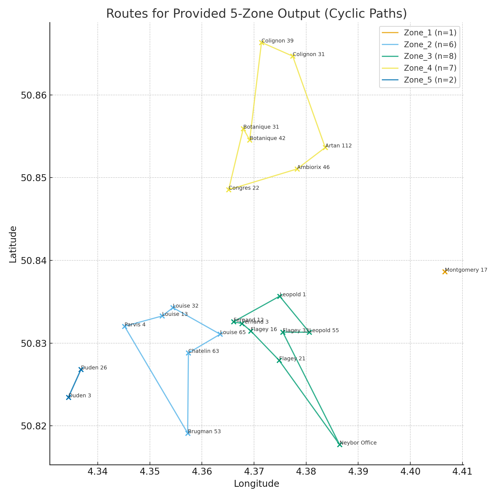

# Neybor-Route-Planner-5-Zone-Optimization
This script automatically groups Neybor houses into five optimized geographic zones using a K-Means++ clustering algorithm, then computes the shortest cyclic route between houses inside each zone.
It’s a practical routing tool for property & operations who need to plan maintenance tickets for maintenance team or event organizers who need to plan house visits efficiently ensuring that each zone has a clear, logical path.
---
# Map Output
The 5 optimized zones and cyclic routes are visualized here:
Each colored loop shows one zone’s travel path.

---
# How It Works
Step 1: Clustering (K-Means++)

The algorithm groups all houses into 5 clusters based on their latitude/longitude.

Initialization uses K-Means++ to ensure robust and reproducible grouping.

Step 2: Route Calculation

For each zone:

Compute all pairwise distances (Haversine formula).

Start at the house closest to the cluster centroid.

Build a route using Nearest Neighbor.

Refine it using 2-Opt to reduce total path distance.

Close the cycle (return to start).

Step 3: Output

Results by zone
as it's shown in the map.
---
# License & Attribution

This planner was created for Neybor community logistics to optimize routes between coliving houses in Brussels.
It’s lightweight, transparent, and easily customizable.
